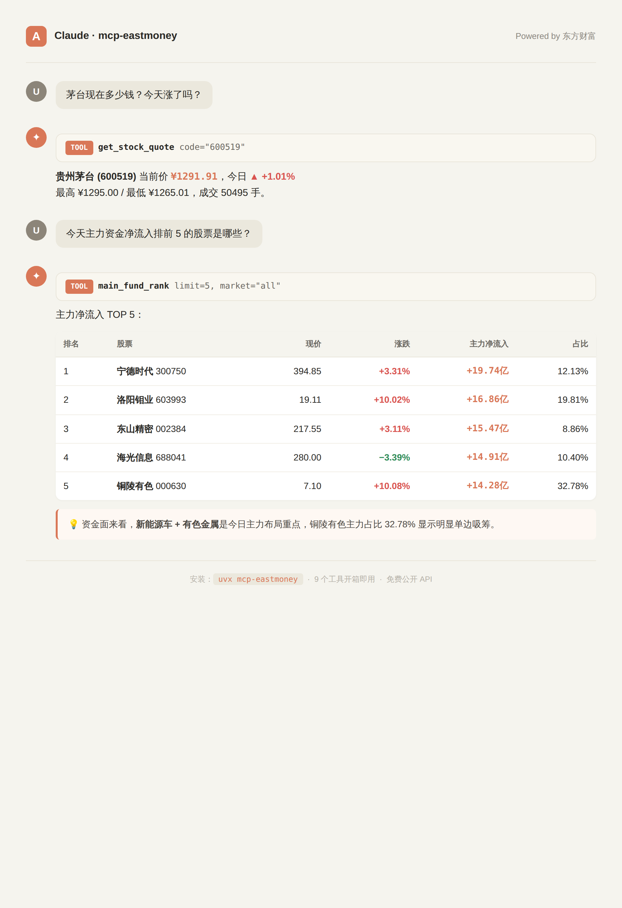

# mcp-eastmoney

> 🇨🇳 让 Claude / Cursor / Codex 等 MCP 客户端直接查询 A 股实时数据 — 免 API Key、开箱即用

[](https://www.python.org/downloads/)
[](https://opensource.org/licenses/MIT)
[](https://modelcontextprotocol.io)

[English](#english) | [中文](#中文)

<p align="center">
  
  <br>
  <sub>👆 在 Claude Desktop 中直接用自然语言查询 A 股行情和主力资金</sub>
</p>

---

## 中文

**mcp-eastmoney** 是基于 [Model Context Protocol](https://modelcontextprotocol.io) 的 A 股数据服务器，让 AI 助手能直接调用东方财富的实时行情、主力资金、板块资金流和 K 线数据。

### ✨ 特性

- 🆓 **完全免费** — 使用东方财富公开延时接口（`push2delay.eastmoney.com`），无需 API Key
- 🇨🇳 **中文金融场景** — 全 A 股市场覆盖（沪深京），返回结构化中文字段
- ⚡ **5 个核心 Tool** — 实时行情、股票搜索、主力资金排名、板块资金流、历史 K 线
- 🔌 **标准 MCP 协议** — 兼容 Claude Desktop / Cursor / Cline / Continue 等所有 MCP 客户端
- 🐍 **Python + uv** — `uvx mcp-eastmoney` 一键运行

### 🛠️ 提供的 Tools

| Tool | 说明 | 示例 |
|------|------|------|
| `get_stock_quote` | 获取实时行情（价格、涨跌、成交量、PE、换手率） | `get_stock_quote(code="300750")` |
| `search_stock` | 按关键词/拼音/代码搜索股票 | `search_stock(keyword="宁德")` |
| `main_fund_rank` | 主力资金净流入排名（超大单/大单/中单/小单） | `main_fund_rank(market="all", limit=10)` |
| `sector_fund_flow` | 行业/概念板块资金流向 + 领涨股 | `sector_fund_flow(kind="industry", limit=10)` |
| `get_kline` | 历史 K 线（日/周/月线，前复权） | `get_kline(code="600519", period="daily", count=30)` |

### 🚀 快速开始

#### 1. 通过 uvx 安装（推荐）

```bash
uvx mcp-eastmoney
```

#### 2. 通过 pip 安装

```bash
pip install mcp-eastmoney
mcp-eastmoney
```

#### 3. 接入 Claude Desktop

编辑 `~/Library/Application Support/Claude/claude_desktop_config.json`（macOS）或 `%APPDATA%\Claude\claude_desktop_config.json`（Windows）：

```json
{
  "mcpServers": {
    "eastmoney": {
      "command": "uvx",
      "args": ["mcp-eastmoney"]
    }
  }
}
```

重启 Claude Desktop，即可看到 5 个新工具。

> 📚 **完整集成教程**：[`examples/CLAUDE_DESKTOP.md`](examples/CLAUDE_DESKTOP.md) — 含故障排查 + 50+ 实战 prompts ([sample_prompts.md](examples/sample_prompts.md))

#### 4. 接入 Cursor

在 Cursor 设置 → MCP 中添加：

```json
{
  "mcpServers": {
    "eastmoney": {
      "command": "uvx",
      "args": ["mcp-eastmoney"]
    }
  }
}
```

### 💬 使用示例

向 Claude 提问：

> **你**: 帮我看一下宁德时代现在的股价和主力资金情况

> **Claude** *(自动调用 `get_stock_quote` + `main_fund_rank`)*:
> 宁德时代（300750）当前 ¥394.85，涨 3.31%，成交 162.79亿。今日主力净流入 19.74亿，居全市场第一，其中超大单净流入 15.04亿，机构资金高度集中…

> **你**: 今天哪些行业板块资金流入最多？

> **Claude** *(调用 `sector_fund_flow`)*:
> 1. 有色金属：+144.09亿（领涨股 金钼股份 +10.0%）
> 2. 电力设备：+91.76亿（领涨股 宁德时代）
> 3. 工业金属：+83.69亿…

### 📊 返回数据样例

```json
{
  "code": "300750",
  "name": "宁德时代",
  "price": 394.85,
  "change": 12.65,
  "change_pct": 3.31,
  "open": 389.99,
  "high": 399.54,
  "low": 383.30,
  "prev_close": 382.20,
  "volume": 414208,
  "amount": "162.79亿",
  "turnover_rate": 0.97,
  "pe": 12.65
}
```

### ⚠️ 数据说明

- 数据来源于东方财富**延时**接口（约 15 分钟延迟），仅供研究参考
- 不构成任何投资建议
- 接口由东方财富免费提供，请合理控制请求频率

### 🤝 贡献

欢迎 PR！计划中的功能：
- [ ] 资金日历、龙虎榜
- [ ] 财务报表数据
- [ ] 北向资金 / 港股 / 美股
- [ ] 技术指标计算（MA/MACD/KDJ）

### 📜 License

MIT

---

## English

**mcp-eastmoney** is an [MCP (Model Context Protocol)](https://modelcontextprotocol.io) server that exposes China's A-share stock market data to AI assistants — powered by Eastmoney's free public APIs.

### ✨ Features

- 🆓 **Zero config** — uses Eastmoney's free delayed-quote endpoints, no API key needed
- 🇨🇳 **A-share native** — covers Shanghai / Shenzhen / Beijing exchanges with proper Chinese fields
- ⚡ **5 core tools** — real-time quotes, stock search, capital flow ranking, sector flow, K-line history
- 🔌 **Standard MCP** — works with Claude Desktop, Cursor, Cline, Continue, and any MCP client
- 🐍 **Python + uv** — one-line install: `uvx mcp-eastmoney`

### 🛠️ Available Tools

| Tool | Description |
|------|-------------|
| `get_stock_quote` | Real-time quote (price, change, volume, PE, turnover) |
| `search_stock` | Search by keyword / pinyin / code |
| `main_fund_rank` | Main capital net inflow ranking (super-large / large / medium / small orders) |
| `sector_fund_flow` | Industry / concept sector capital flow with leading stocks |
| `get_kline` | Historical OHLCV (daily / weekly / monthly, forward-adjusted) |

### 🚀 Quick Start

Install with `uvx`:

```bash
uvx mcp-eastmoney
```

Add to Claude Desktop config:

```json
{
  "mcpServers": {
    "eastmoney": {
      "command": "uvx",
      "args": ["mcp-eastmoney"]
    }
  }
}
```

### ⚠️ Disclaimer

Data is delayed (~15 min) and provided "as-is" by Eastmoney. **Not financial advice.** Use responsibly.

### 📜 License

MIT
